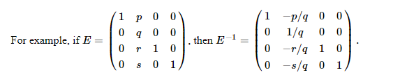

# Revised Simplex Algorithm

### This repository contains my implementation of the Revised Simplex Method (or Revised Simplex Algorithm). I closely follow the outline of the algorithm as described in "Linear Programming" by Vasek Chvatal. I tried to use as few dependancies as possible, but due to effciency issues, decided to use the 'scipy.ling' package (a wrapper for LAPACK) for computing the LU decomposition. All other matrix operations are carried out in numpy.

This optimization method requires to solve systems of the kind yB = c and Bd = a (for y and d respectively). As optimization problems with many variables and constraints could result in a very large B matrix, inverting B may be very costly and inaccurate (due to rounding errors). A very cool feature of the method described by Chvatal, makes use of the popular "product form of the inverse" - instead of inverting B directly in each iteration, it may be factored into 'Elementary Matrices' (also called 'Eta Matrices': matrices that only differ from Identity Matrices in one column), as every B only changes in one column every iteration. 

These ETA-Matrices still need to be inverted to solve for y and d, but **each inverse of E is very easy to solve**:

So far we considered the case of the initial B consisting of slack variables, namely B = I and thus inv(B) = I as well. If the initial B is not the identity matrix, we need still need to solve yB = c and Bd = a in the first iteration of the algorithm, since we can only factor B after the first iteration- so we need the initial B for reference. For this reason we use a triangular factorization of L, P and U (these matrices are obtained from the LU-decomposition of B). Triangular because of the shape of L and U and factorization because we make use of Eta Matrices again to compute inverses of L, P and U. So to compute the current B in each interation, we compute the initial B (through triangular factorization of the LU decomposition of B) in conjuction with the growing sequence of Eta Matrices of B itself as described above.

This way we avoid to compute the explicit inverse of B completely. Neat!
